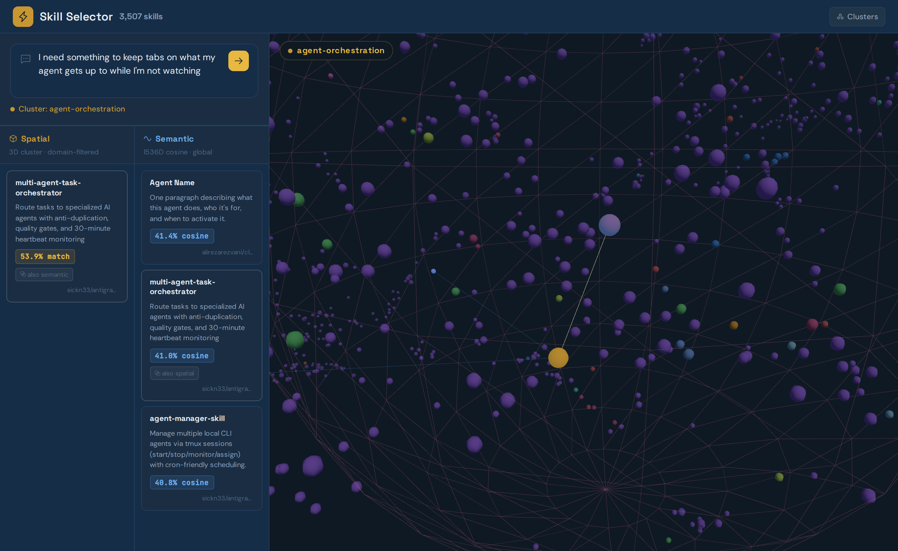
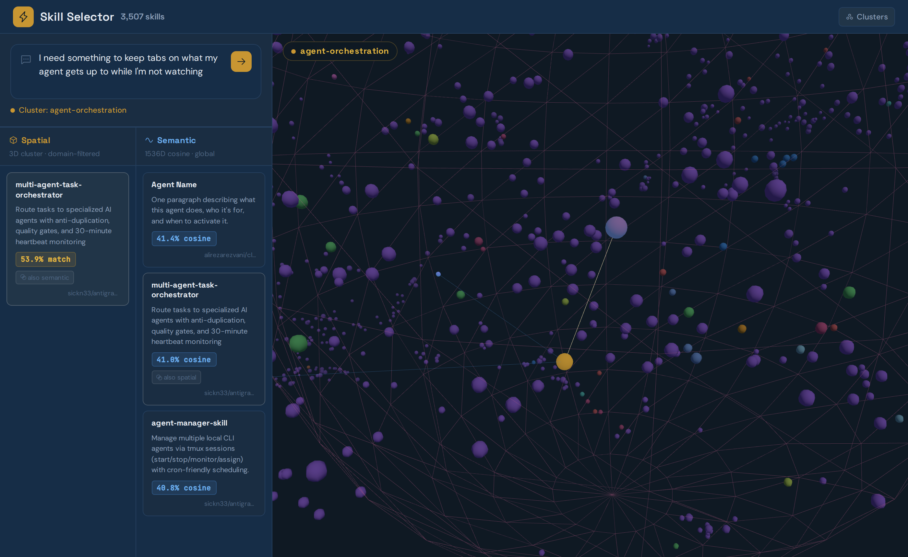
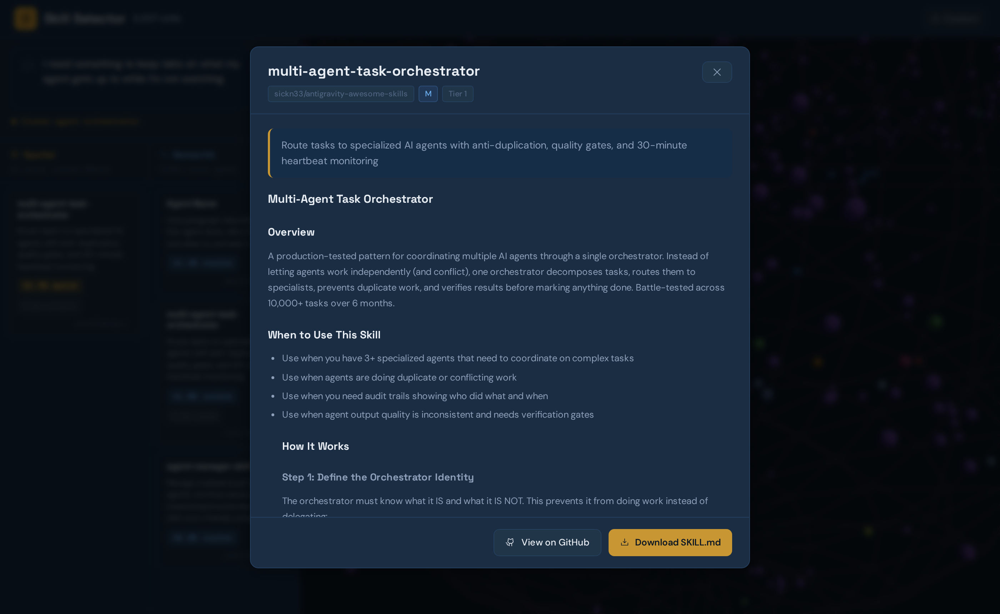

# Skill Selector

Semantic spatial search over a corpus of Claude skills. Paste an agent message or describe what you need — the system embeds your query, projects it into a 3D semantic space built from 3,500+ skills, and returns the closest matches ranked by a blend of cosine similarity and PostGIS spatial distance.



---

## How it works

**Offline (ingest):**

1. Crawl GitHub repos containing `SKILL.md` files (hosted repos + link-lists)
2. Parse frontmatter and body — extract name, description, category, size tier
3. Embed each skill's description via `text-embedding-3-small` (1536D)
4. Fit a UMAP reducer over the full embedding corpus → project every skill to 3D
5. Write embeddings + 3D coordinates to PostGIS (`skill_selector.skills`)
6. Compute per-domain centroids and local projections (`skill_selector.domains`, `skill_selector.skill_domains`)

**Runtime (per query):**

1. Embed the query → mean-pool chunks if > 500 chars
2. Apply the saved UMAP transform → 3D query point
3. Find the nearest domain centroid by cosine (confidence threshold: 0.35)
4. Retrieve top 50 candidates — domain-filtered HNSW search if confident, global search otherwise
5. Re-rank: **70% cosine + 30% inverted spatial distance**
6. Return top-k with both scores and 3D coordinates for the live point cloud

---

## Screenshots

### Spatial vs semantic results — side by side
The left column uses domain-filtered 3D nearest-neighbour search. The right column uses global cosine similarity against all 1536D embeddings. Results often overlap but diverge in interesting ways — spatial picks up cluster membership, cosine picks up vocabulary.



### Skill detail modal
Click any result card to read the full `SKILL.md` body, see match scores, and download or view the source on GitHub.



---

## Stack

| Layer | Technology |
|---|---|
| API server | FastAPI — port 8200 |
| Embeddings | OpenAI `text-embedding-3-small` (1536D) |
| Dimensionality reduction | UMAP → 3D, pickled to `umap_transform.pkl` |
| Database | PostgreSQL + pgvector + PostGIS |
| Vector search | HNSW index (`vector_cosine_ops`) |
| Spatial search | GiST index on `geometry(PointZ, 0)` |
| Frontend | Vanilla JS + Three.js point cloud |
| Skill sources | GitHub crawl — `SKILL.md` convention |

---

## Setup

### 1. Database

Requires PostgreSQL with `pgvector` and `postgis` extensions. Set `DATABASE_URL` in your environment or `.secrets.env`.

```bash
psql $DATABASE_URL -f schema.sql
```

### 2. Dependencies

```bash
python -m venv .venv && source .venv/bin/activate
pip install -r requirements.txt
```

### 3. Ingest

```bash
# Seed run — crawl Anthropic + obra repos only
python ingest.py

# All known hosted repos
python ingest.py --repos all

# All hosted + link-list repos
python ingest.py --repos all --linklist

# Re-embed only, keep existing UMAP
python ingest.py --skip-umap

# Dry run — crawl and parse, no DB writes
python ingest.py --dry-run
```

Ingestion writes embeddings, fits UMAP, stores 3D coordinates in PostGIS, and saves the reducer to `umap_transform.pkl`.

### 4. Serve

```bash
python server.py
# http://0.0.0.0:8200
```

`HOST` and `PORT` can be overridden via environment variables. Hot reload is enabled.

---

## API

| Route | Description |
|---|---|
| `POST /api/search` | Semantic + spatial search. Body: `{"query": "...", "top_k": 9}` |
| `POST /api/compare` | Side-by-side: top-3 spatial vs top-3 pure-semantic for the same query |
| `GET /api/skills` | Paginated skill list — filter by `category`, `size` |
| `GET /api/skills/{name}` | Full skill detail including body |
| `GET /api/pointcloud` | All skill 3D coordinates + domain centroids + r60 radii |
| `GET /api/pointcloud/domain/{name}` | Per-domain local projection coordinates |
| `GET /api/categories` | Category list with counts |

### Search response shape

```json
{
  "results": [
    {
      "name": "multi-agent-task-orchestrator",
      "url": "https://github.com/...",
      "source_repo": "sickn33/antigravity-awesome-skills",
      "category": "agent-orchestration",
      "description": "Route tasks to specialized AI agents...",
      "size": "M",
      "score": 0.539,
      "cosine_score": 0.418,
      "spatial_dist": 0.21,
      "embed_tier": 1,
      "point_3d": {"x": -0.12, "y": 1.87, "z": 0.44}
    }
  ],
  "domain": "agent-orchestration",
  "domain_score": 0.61,
  "query_points": [{"x": -0.09, "y": 1.83, "z": 0.41, "is_centroid": true}]
}
```

---

## Database schema

```
skill_selector.skills          — one row per skill
  embedding   vector(1536)     — HNSW index (cosine)
  point_3d    geometry(PointZ) — GiST index (spatial KNN)

skill_selector.domains         — one row per category cluster
  centroid    vector(1536)     — mean embedding across all skills in domain
  centroid_3d geometry(PointZ) — UMAP-projected domain centre

skill_selector.skill_domains   — junction table
  point_3d_local geometry(PointZ) — per-domain local UMAP projection
```

---

## Environment

| Variable | Purpose |
|---|---|
| `DATABASE_URL` | PostgreSQL connection string |
| `OPENAI_API_KEY` | Embedding model (preferred) |
| `OPENROUTER_API_KEY` | Fallback if `OPENAI_API_KEY` not set |
| `GITHUB_TOKEN` | GitHub API — increases crawl rate limits |
| `HOST` / `PORT` | Server bind (default `0.0.0.0:8200`) |

---

## Skill sources

Skills are crawled from GitHub repos that follow the `SKILL.md` convention — a markdown file with YAML frontmatter (`name`, `description`, `category`, `size`) and a body explaining when and how to use the skill.

`github.py` supports two crawl strategies:

- **Strategy A — hosted repos:** Direct clone + parse of repos listed in `REPOS_HOSTED`
- **Strategy B — link-lists:** Repos that contain a curated list of links to other skill repos (`REPOS_LINKLIST`)

To add a new source, append an entry to `REPOS_HOSTED` or `REPOS_LINKLIST` in `github.py` and re-run `ingest.py`.
